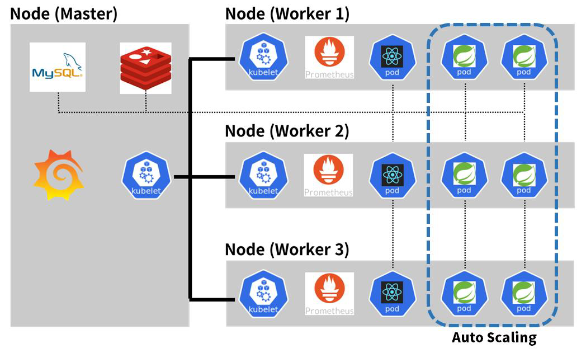

# Shorket: 클러스터링을 이용한 쿠버네티스 기반 전국 플리마켓 운영지원 서비스

    

<h4 align="center">클러스터링을 이용한 쿠버네티스 기반 전국 플리마켓 운영지원 서비스</h4>

  <a href="#overview">Overview</a></a> * 
  <a href="#features">Features</a></a> * 
  <a href="#contributors">Contributors</a> * 
  <a href="#architecture">Architecture</a> * 
  <a href="#license">License</a>

    Shorket은 2022 한이음 "22_HI038 클러스터링을 이용한 쿠버네티스 기반 서비스 구현" 프로젝트로 진행된 결과물입니다.
     
    상업적 목적을 띄고 있지 않으며, 팀 <b>솔미솔솔솔</b>에 의해 개발되었습니다.

## Overview

‘Shorket’은 Short와 Market의 합성어로, 플리마켓이나 부스행사 등 3~7일의 매우 짧은 기간동안 운영되는 기간제 스토어의 전반적 운영을 지원하는 서비스이다. 라즈베리파이 4대를 이용, 쿠버네티스 환경의 클러스터에서 서비스된다.

‘Shorket’은 크게 방문자, 판매자, 관리자의 세 역할로 구분되며, 방문자는 어떤 플리마켓이 열리는지, 해당 플리마켓에서 어떤 부스가 열리는지 등 **플리마켓 관련 전반적인 검색**이 가능하다. 관리자는 본인이 열게될 플리마켓을 등록하고, 플리마켓 홍보 페이지 등을 만드는 등 Shorket을 통해 **플리마켓에 관한 전반적인 정보 제공**이 가능하다. 판매자는 관리자가 연 플리마켓에 부스를 등록하여 자신의 부스 소개글과 함께 어떤 물품을 판매하는지 등록하는 등 자신의 **부스에 관한 전반적인 정보를 제공**할 수 있다.

## Features

#### 마켓 관리

관리자는 마켓 관리를 통해 본인이 운영하는 **마켓을 관리**할 수 있다.

#### 마켓 등록

관리자는 마켓 등록을 통해 본인이 운영할 **마켓을 등록**할 수 있다.

#### 부스 관리

판매자는 마켓에 부스를 등록하고, 부스 소개나 판매 물품 등록 등 **자신의 부스를 관리**할 수 있다.

#### 마켓 탐색

방문자는 언제, 어디서, 어떤 종류의 마켓이 열리는지 **마켓을 탐색**할 수 있다.

## Contributors

박지윤 [@PrimWILL](https://github.com/PrimWILL) : Lead, Infra, Backend  
김동은 : Frontend  
김태윤 [@Chokoty](https://github.com/Chokoty) : Frontend  
우다현 [@DahyeonWoo](https://github.com/DahyeonWoo) : Backend  
정재욱 [@Wo-ogie](https://github.com/Wo-ogie) : Backend  

## Architecture

    

## License

`Shorket` project is [licensed](./LICENSE) under the terms of **the Apache License 2.0**.